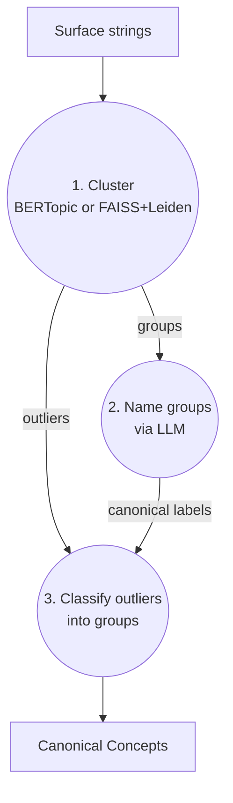

# nobs-canonicalize

Canonicalize verbose text strings into clean, deduplicated canonical groups using embeddings + LLM reasoning.

> [!CAUTION]
> This library is in early development. It is not ready for production use.

Given a list of noisy, verbose text strings (e.g. medical interventions, product names, user inputs), this library:
1. **Clusters** similar strings using BERTopic or FAISS+Leiden
2. **Names** each cluster with a clean canonical label via LLM (o3-mini)
3. **Classifies outliers** into the named groups, reducing ungrouped items

## How it works



1. **Cluster** — Groups surface strings using `text-embedding-3-large` embeddings
2. **Name** — `o3-mini` generates a clean canonical label for each group
3. **Classify outliers** — `o3-mini` assigns ungrouped strings into the named groups
4. **Output** — deduplicated canonical concepts ready for downstream use

## Clustering backends

Two clustering backends are available, selectable via the `backend` parameter:

### BERTopic (default)

Uses HDBSCAN + UMAP under the hood. Good for small-to-medium datasets.

### FAISS+Leiden

Uses FAISS nearest-neighbor search to build a kNN similarity graph, then Leiden community detection to find clusters. Better for large datasets.

**Why use FAISS+Leiden over BERTopic?**

- **Scale** — BERTopic's UMAP+HDBSCAN pipeline slows down significantly past ~50K strings. FAISS is built for large-scale similarity search and Leiden scales to graphs with millions of nodes.
- **Lighter dependencies** — BERTopic pulls in `hdbscan`, `umap-learn`, and `sentence-transformers`. FAISS+Leiden only needs `faiss-cpu` and `python-igraph`.
- **Tunable graph construction** — You control the kNN graph directly via `n_neighbors` and `min_sim` (minimum cosine similarity threshold), which often matters more than clustering algorithm parameters.

**Comparison on 1,022 diet intervention strings:**

| Backend | Clusters | Outliers | Outlier % |
|---------|----------|----------|-----------|
| BERTopic (default) | 65 | 170 | 16.7% |
| FAISS+Leiden (default) | 63 | 178 | 17.5% |
| FAISS+Leiden (min_cluster_size=3) | 75 | 142 | 13.9% |
| FAISS+Leiden (min_cluster_size=2) | 98 | 93 | 9.1% |

Both backends produce similar cluster quality. Outliers are handled downstream by the LLM classification step regardless of backend.

## Install

```shell
pip install nobs-canonicalize
```

Requires `python >= 3.11, < 3.15`.

## Example usage

### OpenAI (BERTopic backend — default)

```python
import os

from dotenv import load_dotenv
from rich import print

from nobs_canonicalize import nobs_canonicalize

load_dotenv()
openai_api_key = os.environ["OPENAI_API_KEY"]

texts = [
    "16/8 fasting",
    "16:8 fasting",
    "24-hour fasting",
    "24-hour one meal a day (OMAD) eating pattern",
    "2:1 ketogenic diet, low-glycemic-index diet",
    "30-day nutrition plan",
    "36-hour fast",
    "4-day fast",
    "40 hour fast, low carb meals",
    "4:3 fasting",
    "5-day fasting-mimicking diet (FMD) program",
    "7 day fast",
    "84-hour fast",
    "90/10 diet",
    "Adjusting macro and micro nutrient intake",
    "Adjusting target macros",
    "Macro and micro nutrient intake",
    "AllerPro formula",
    "Alternate Day Fasting (ADF), One Meal A Day (OMAD)",
    "American cheese",
    "Atkin's diet",
    "Atkins diet",
    "Avoid seed oils",
    "Avoiding seed oils",
    "Limiting seed oils",
    "Limited seed oils and processed foods",
    "Avoiding seed oils and processed foods",
]

clusters = nobs_canonicalize(
    texts=texts,
    openai_api_key=openai_api_key,
    reasoning_effort="low",  # low, medium, high
    subject="personal diet intervention outcomes",
)
print(clusters)
```

### OpenAI (FAISS+Leiden backend)

```python
clusters = nobs_canonicalize(
    texts=texts,
    openai_api_key=openai_api_key,
    reasoning_effort="low",
    subject="personal diet intervention outcomes",
    backend="faiss_leiden",  # use FAISS+Leiden instead of BERTopic
)
```

### Azure OpenAI

```python
import os

from dotenv import load_dotenv

from nobs_canonicalize import nobs_canonicalize_azure, AzureConfig

load_dotenv()

azure_config = AzureConfig(
    api_key=os.environ["AZURE_OPENAI_API_KEY"],
    api_version="2024-12-01-preview",
    azure_endpoint="https://your-resource.openai.azure.com/",
    embedding_deployment="text-embedding-3-large",  # default
    llm_deployment="o3-mini",                        # default
)

clusters = nobs_canonicalize_azure(
    texts=texts,
    reasoning_effort="low",
    subject="personal diet intervention outcomes",
    azure_config=azure_config,
    backend="faiss_leiden",  # optional, defaults to "bertopic"
)
print(clusters)
```

## Example output


## Contributing

```shell
git clone git@github.com:borisdev/nobs-canonicalize.git
cd nobs-canonicalize
pip install -e .
# set the OPENAI_API_KEY in the code or as an environment variable
poetry run pytest tests/test_models.py -v  # unit tests, no API key needed
poetry run pytest tests/test_main.py::test_nobs_canonicalize -v  # integration test
```
