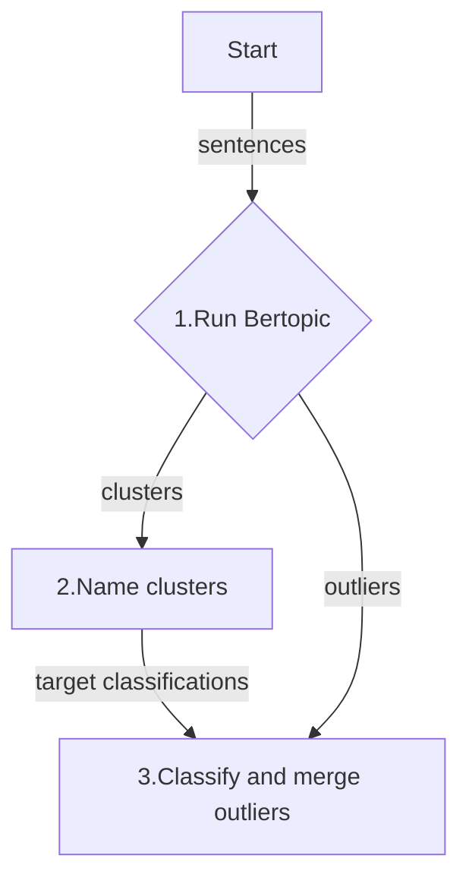

# nobs-clusters

The purpose of this library is to reduce development time
needed to cluster documents into topics, at least for your prototype.

> [!CAUTION]
> This library is in early development. It is not ready for production use.

The library has been tested on 2,500 sentences. A smell test of 10,000 sentences
seems to pass, but of of course, the topic quality will be unknown, so be cautious and evaluate carefully.

The approach here is to use DBSAN clustering algorithm from [BERTopic](https://maartengr.github.io/BERTopic/index.html)
along with OPENAI's `o3-mini` LLM model to name the clusters and classify outliers.

## Motivations

-   Topic modeling is a time-consuming development task. I did not find any
    tools to help me quickly make quality topics for my prototype. BERTopic
    library is a great tool, but it is not easy to use with complicated
    options.
-   **OpenAI's cutting-edge `o3-mini`** names clusters well, and reduces outliers better than [BERTopic](https://maartengr.github.io/BERTopic/index.html)'s default method.

## Example usage

### OpenAI

```python
import os

from dotenv import load_dotenv
from rich import print

from nobs_clusters import nobs_cluster

load_dotenv()
openai_api_key = os.environ["OPENAI_API_KEY"]

texts = [
    "16/8 fasting",
    "16:8 fasting",
    "24-hour fasting",
    "24-hour one meal a day (OMAD) eating pattern",
    "2:1 ketogenic diet, low-glycemic-index diet",
    "30-day nutrition plan",
    "36-hour fast",
    "4-day fast",
    "40 hour fast, low carb meals",
    "4:3 fasting",
    "5-day fasting-mimicking diet (FMD) program",
    "7 day fast",
    "84-hour fast",
    "90/10 diet",
    "Adjusting macro and micro nutrient intake",
    "Adjusting target macros",
    "Macro and micro nutrient intake",
    "AllerPro formula",
    "Alternate Day Fasting (ADF), One Meal A Day (OMAD)",
    "American cheese",
    "Atkin's diet",
    "Atkins diet",
    "Avoid seed oils",
    "Avoiding seed oils",
    "Limiting seed oils",
    "Limited seed oils and processed foods",
    "Avoiding seed oils and processed foods",
]

clusters = nobs_cluster(
    texts=texts,
    openai_api_key=openai_api_key,
    reasoning_effort="low",  # low, medium, high ... slow, slower, slowest
    subject="personal diet intervention outcomes",
)
print(clusters)
```

### Azure OpenAI

```python
import json
import os

from dotenv import load_dotenv

from nobs_clusters import nobs_cluster_azure, AzureConfig

load_dotenv()

azure_config = AzureConfig(
    api_key=os.environ["AZURE_OPENAI_API_KEY"],
    api_version="2024-12-01-preview",
    azure_endpoint="https://your-resource.openai.azure.com/",
    embedding_deployment="text-embedding-3-large",  # default
    llm_deployment="o3-mini",                        # default
)

clusters = nobs_cluster_azure(
    texts=texts,
    reasoning_effort="low",
    subject="personal diet intervention outcomes",
    azure_config=azure_config,
)
print(clusters)
```

## Example output


## What's happening under the hood? The three steps...

This is a opinionated hybrid approach to topic modeling using a combination of
embeddings and LLM completions. The embeddings are for clustering and the LLM
completions are for naming and outlier classification.



### Step 1 - Cluster sentences

Bertopic library clusters using embeddings from a `text-embedding-3-large` LLM model.

### Step 2 - Name clusters

Names are generated by a `o3-mini` LLM model for the resulting clusters from **Step 1**.

### Step 3 - Re-group outliers

Outlier sentences, those that did not fit into any of the Bertopic clusters
from **Step 1**, are classified by the `o3-mini` LLM using the resulting
cluster names from **Step 2**.

### Install

#### Pre-requisites

-   `python = ">=3.11,<3.15"`

```shell
pip install nobs-clusters
```

## Some BERTopic FAQs

[Why does it take so long to import BERTopic?](https://maartengr.github.io/BERTopic/faq.html#how-can-i-use-bertopic-with-chinese-documents)

## Pointers for contributing developer

Run a smoke test

```shell
git clone git@github.com:borisdev/nobs-clusters.git
cd nobs-clusters
pip install -e .
# set the OPENAI_API_KEY in the code or as an environment variable
poetry run pytest tests/test_models.py -v  # unit tests, no API key needed
poetry run pytest tests/test_main.py::test_nobs_cluster -v  # integration test
# remember it takes a while to import the bertopic library
```

-   make a tiny PR so I can see how I can help you get started
